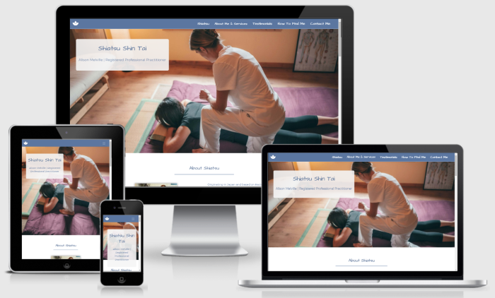

# Alison Melville's Shiatsu Shin Tai

## About

**Alison Melville's Shiatsu** needs a B2C website that showcases a massage business specialising in Shin Tai near Manchester. I designed the site to educate the user about the benefits of Shiatsu Shin Tai and allow them to contact her to book a consultation. 

I created the site to look professional and in keeping with the theme of similar Shiatsu websites and using the colour schemes to bring a relaxing impression as would be expected with a massage site. It is designed to be responsive and accessible on a range of devices, making it easy to navigate for potential and existing clients.

The goal of the website will be to interact with existing and potential clients and be a source of information to educate them, build confidence and encourage them to contact the business owner.

The site must contain all information required to complete these goals and site visitors will most likely be comparing with other similar services in the local area so must stand out and show everything the user would want to see.

Link to [live site](https://suzybee1987.github.io/alison_melville_business/)

## **Contents**

- [**UX (User Experience)**](#ux-user-experience)
  - [**User Stories**](#user-stories)
  - [**Site Owner Goals**](#site-owner-goals)
- [**Design Choices**](#design-choices)
  - [**Imagery**](#imagery)
- [**Technologies**](#technologies)
  - [**Languages**](#languages)
  - [**Libraries**](#libraries)
  - [**Tools**](#tools)
- [**Credits**](#credits)
  - [**Code**](#code)
  - [**Content**](#content)
  - [**Images**](#images)
  - [**Videos**](#videos)
  - [**Inspiration**](#inspiration)
  - [**Acknowledgements**](#acknowledgements)
  

## **UX (User Experience)**

### **User Stories**
- As a user visiting the site for the first time:
  - I want to be able to see social media links so that I can keep up to date through Facebook, Instagram and Twitter.
  - I want to click the navigation links to be taken to the correct section and also back to home for a better user experience.
  - I want the page to be in a predictable layout so that I can navigate it easily.  
  - I want to see a map of the location so that I can determine how close it is to my location and navigate there easily.  
  - I want to easily understand the main purpose of the site and learn more about the business.
  - I want to see testimonials to understand what previous users think of them and see if they are trusted.

- As a user returning to the site:
  - I want to be able to access the site easily on my chosen device
  - I want to easily be able to navigate to different parts of the site
  - I want to be able to contact the business owner as I wish through social media or contact form

- As a user who has never had a Shiatsu Shin Tai Massage before:
   - I want to use the site to learn more about Shiatsu Shin Tai and how to contact the business owner so that I can ask questions.
   - I want to see a demonstration of what to expect when receiving a Shiatsu Shin Tai massage.
   - I want some information about the price and time required per session
   - I want some information about the business owner's qualifications.

### **Site Owner Goals** 
- As a site owner I want the user to learn about Shiatsu Shin Tai massage and the business owner.
- As a site owner I want the user to be able to communicate with the business owner on social media and through contact form.
- As a site owner I want to show the user that the business owner is a registered practitioner of her work.
- As a site owner I want to create a website with a great user experience so that visitors will come again. 

[Back to contents](#contents)

## **Design Choices**

### **Imagery**

Images feature Shin Tai massages being performed, a profile of the business owner and continue with the relaxing theme of the site.
Some of the images have been sourced from [Unsplash](https://unsplash.com/) and are free to use if credited and others were provided by the business owner. 
The images were chosen because they show the massage being given and give the user an idea of what to expect straight away. 

## **Technologies**

### **Languages**

- [HTML5](https://developer.mozilla.org/en-US/docs/Web/HTML)
  - Used as the main markup language for the website content.
- [CSS3](https://developer.mozilla.org/en-US/docs/Web/CSS)
  - Used to style the individual webpages.
- [jQuery](https://developer.mozilla.org/en-US/docs/Glossary/jQuery) and [Popper.js](https://popper.js.org/)
  - Used with Bootstrap Scrollspy to track location on the page and Bootstrap Collapse for Accordion sections on mobile and tablet view. Also used with the contact form to launch the modal after required fields on form were completed. 

### **Libraries**

- [Bootstrap](https://getbootstrap.com/)
  - Used to design a mobile-first responsive website layout along with custom components (navigation bar + toggle button, accordion, cards, scrollspy, footer, jumbotron).
  
### **Tools**

- [Git](https://git-scm.com/)
  - Git was used for version control (commit to Git and push to GitHub).
- [GitHub](https://github.com/)
  - Used to store, host and deploy the project files and source code after being pushed from Git. I also used it for the Project Kanban board to keep track and split tasks into smaller tasks to make them easier to fulfill.
- [Gitpod](https://www.gitpod.io/)
  - An online IDE linked to the GitHub repository used to write my code.
- [Font-Awesome](https://fontawesome.com/icons?d=gallery)
  - Used to make headings stand out.
- [Google fonts](https://fonts.google.com/)
  - Used to compare and choose fonts. 
- [Coolors](https://coolors.co/)
  - Used to research and choose the colour scheme by comparing and contrasting similar colours in the generator.
- [Favicons](https://favicon.io/)
  - Used to generate a favicon for the website title.
- [Lighthouse](https://developers.google.com/web/tools/lighthouse)
  - Used to audit the site for quality and ensure responsiveness.
- [WebPageTest](https://www.webpagetest.org/)
  - Used to test performance.
- [amiresponsive](http://ami.responsivedesign.is/)
  - An online tool to check how responsive the site is on different devices.
- [tinypng](https://tinypng.com/)
  - Used to reduce the size of the images for better user experience.

[Back to contents](#contents)

## **Testing**

### **User Story Testing**

Testing was completed to make sure the user goals were completed

- As a user visiting the site for the first time:
  - [x]I want to be able to see social media links so that I can keep up to date through Facebook, Instagram and Twitter.
    -Social media links open in new tabs
  - [x]I want to click the navigation links to be taken to the correct section and also back to home for a better user experience.
    -Navigation links work correctly to direct to the right part of the site.
  - [x]I want the page to be in a predictable layout so that I can navigate it easily.  
    -The layout is colour coordinated to make it easy to see where each section starts and ends.
  - [x]I want to see a map of the location so that I can determine how close it is to my location and navigate there easily.  
    -Google Map with the local area featured in Find Me section. 
  - [x]I want to easily understand the main purpose of the site and learn more about the business.
  - [x]I want to see testimonials to understand what previous users think of them and see if they are trusted.

- As a user returning to the site:
  - [x]I want to be able to access the site easily on my chosen device
    -Site is responsive on all devices tested and Google Dev Tools
  - [x]I want to easily be able to navigate to different parts of the site
    -Fixed navigation at top of page and scroll spy allows for easy navigation
  - [x]I want to be able to contact the business owner as I wish through social media or contact form
    -Contact form available and social media links to keep in touch with business owner.

- As a user who has never had a Shiatsu Shin Tai Massage before:
   - [x]I want to use the site to learn more about Shiatsu Shin Tai and how to contact the business owner so that I can ask questions.
    -Information provided about Shiatsu and Shin Tai to help the user learn more and contact form included.
   - [x]I want to see a demonstration of what to expect when receiving a Shiatsu Shin Tai massage.
    -YouTube video included and description of what to expect for users who can't view the video.
   - [x]I want some information about the price and time required per session
    -Pricing information available on request due to individual needs. Time of session provided in pricing section
   - [x]I want some information about the business owner's qualifications.
    -About Me section communicates to the user the qualification held through Shiatsu Society and link to their website where the business owner can be verified. 

### **Code**

- CodeInstitute Full Stack Developer Course
- LinkedIn Learning course by [James Williamson](https://www.linkedin.com/learning/html-essential-training-2017/)
- LinkedIn Learning course by [Christina Truong](https://www.linkedin.com/learning/css-essential-training-3/)

### **Content**

- The information provided regarding Shiatsu was provided by the business owner, Alison Melville. 
- README.md help came from: 
  -[Code Institute](https://github.com/Code-Institute-Solutions/SampleREADME)
  -CI Student [Simon Vardy](https://github.com/simonjvardy/Aviation-Consultancy/blob/master/README.md)
  -My Mentor - Maranatha Ilesanme sent me [Liga Baikova's README.md](https://github.com/LigaMoon/Boredom-guide/blob/master/README.md) to use as a rough template.
  
### **Layout**

-Code Institute lessons using bootstrap
-[Background layout](https://css-tricks.com/perfect-full-page-background-image/) from css-tricks.com

-[Layout fix](https://css-tricks.com/fixed-headers-on-page-links-and-overlapping-content-oh-my/) when contact form overlapped footer

-[Lazy Loading](https://developer.mozilla.org/en-US/docs/Web/Performance/Lazy_loading) added to iframes after reading Lighthouse report which showed these slow down the site loading time. Solution found [here](https://css-tricks.com/the-complete-guide-to-lazy-loading-images/)

-[Modal on submission](https://github.com/natalie-kate/haunted) issue was coming up because the button type="button" was required to make the modal work but this button type doesn't produce error if required fields not completed. Checked on slack and found a solution from post on #peer-code-review where @Nat_kate managed to fix this issue.

### **Images**

- #index.html
  - The [Hero image](assets/images/conscious-design-J16LdoIsRJM-unsplash.jpg) on index.html was sourced from [Unsplash](https://unsplash.com/). Photo by <a href="https://unsplash.com/@conscious_design?utm_source=unsplash&utm_medium=referral&utm_content=creditCopyText">Conscious Design</a> on <a href="https://unsplash.com/s/photos/massage-therapy?utm_source=unsplash&utm_medium=referral&utm_content=creditCopyText">Unsplash</a>
  - The images of [Alison Performing Shin Tai Massage](assets/images/Ali-massage2.jpg) and [Alison's profile photo](assets/images/ali-photo2.jpg) were taken by her husband, Iain Melville.

- #contact.html
  - The hero image on contact.html was sourced from [Unsplash](https://unsplash.com/). Photo by <a href="https://unsplash.com/@lgence?utm_source=unsplash&utm_medium=referral&utm_content=creditCopyText">Laurent Gence</a> on <a href="https://unsplash.com/@dfu05229/likes?utm_source=unsplash&utm_medium=referral&utm_content=creditCopyText">Unsplash</a>

### **Videos**

-index.html
  - The [Massage Demonstration Video](https://youtu.be/aLYgPbQXyGw) is performed by Saul Goodman who came up with the Shin Tai blend of massage. 
  
  
### **Inspiration**

- Scrollspy navigation inspiration from Peer Code Review project posted by [Claire Lemonair](https://github.com/lemocla/MS1-Catsitting)
- The business owner shared some well known sites to compare to: [Dawn Oei](https://www.dawnoei-shiatsushintai.com/), [Kindy Kaur Shiatsu](https://www.kindykaur.com/)

### **Acknowledgements**

- My Mentor for confidence boosting and helpful advice and feedback.
- Friends and family for testing the site and giving feedback.

[Back to contents](#contents)
